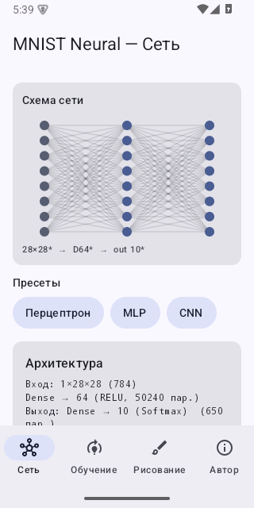
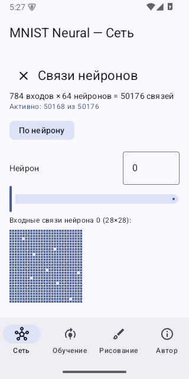
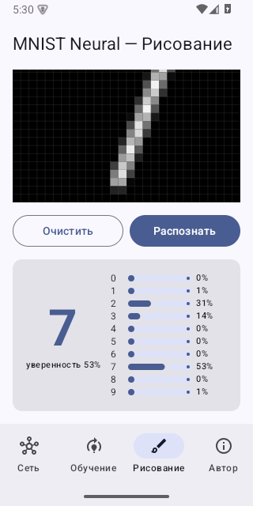
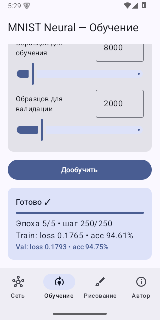
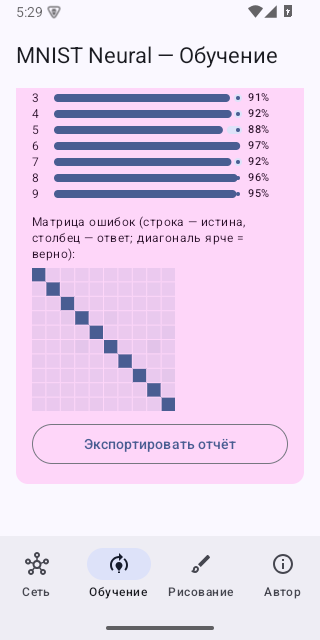
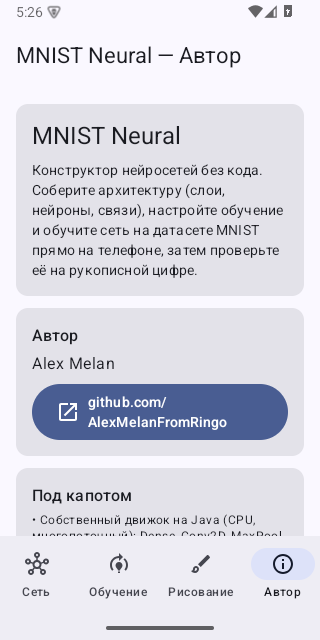

<h1 align="center">MNIST Neural</h1>

<p align="center">
  <b>No-code конструктор нейросетей, которые обучаются на MNIST прямо на телефоне.</b><br/>
  Соберите архитектуру из слоёв, нейронов и связей, обучите её на устройстве и проверьте на своей рукописной цифре.
</p>

<p align="center">
  
  
  
  
  
</p>

<p align="center">
  
  
  
</p>

## Возможности

- **No-code конструктор** — добавляйте и удаляйте слои, меняйте число нейронов и параметры ползунками и полями ввода; живой счётчик параметров и схема сети.
- **Редактор связей по нейронам** — включайте и выключайте отдельные связи через маски. Для большого первого слоя — карта входов 28×28 на каждый нейрон.
- **Слои** — Dense (полносвязный), Conv2D, MaxPool. Flatten и выходной слой добавляются автоматически.
- **Настройка обучения** — эпохи, размер батча, learning rate, momentum, L2, размер выборки.
- **Обучение на устройстве** — собственный многопоточный движок на CPU (без TFLite) ради максимальной совместимости.
- **Рисование и распознавание** — поле 28×28, центрирование по центру масс (как в MNIST), диаграмма вероятностей по классам.
- **Сохранение и загрузка модели**, пресеты (Перцептрон / MLP / CNN), оценка на тесте с поклассовой точностью, матрицей ошибок и экспортом отчёта.

## Скриншоты

| Конструктор | Связи нейронов (28×28) | Рисование и распознавание |
|:---:|:---:|:---:|
|  |  |  |
| **Обучение** | **Оценка и матрица ошибок** | **Об авторе** |
|  |  |  |

## Как это работает

Сердце приложения — собственный движок на чистой Java (пакет `engine/`), не зависящий от Android,
поэтому его можно тестировать на JVM и сверять с эталонными фреймворками:

- прямой и обратный проход для Dense, Conv2D (cross-correlation), MaxPool, Flatten;
- активации ReLU / Sigmoid / Tanh, потери softmax + кросс-энтропия (численно стабильно через log-sum-exp) и MSE;
- многопоточный mini-batch SGD с импульсом, маски связей, сериализация весов.

Датасет хранится как компактный `assets/mnist.bin.gz` (около 10 МБ, 60 000 предварительно перемешанных
образцов) и стримится в память как `byte[]` — без раздувания APK и без OOM.

### Проверка формул

Корректность математики подтверждена двумя независимыми способами:

1. Сверка с PyTorch — эталонные forward, loss и градиенты для Dense, Conv2D и MaxPool (`EngineReferenceTest`).
2. Численная проверка градиента (центральные разности) — независимое подтверждение (`EngineGradientTest`),
   плюс тесты масок, сериализации и сходимости.

```bash
./gradlew testDebugUnitTest   # 9/9 проходят
```

На простом MLP `784 -> 64 -> 10` обучение на устройстве достигает около 94–95% точности за считанные секунды.

## Сборка

```bash
git clone https://github.com/AlexMelanFromRingo/mnist-neural-android.git
cd mnist-neural-android
./gradlew assembleDebug      # APK: app/build/outputs/apk/debug/app-debug.apk
```

Или откройте проект в Android Studio (Giraffe+). Требуется Android SDK 35.
Стек: Kotlin 2.0.21, Jetpack Compose (BOM 2024.10), Material 3 (динамические цвета), AGP 8.7.3, minSdk 26 / target 35.

## Структура

```
app/src/main/java/com/alex_melan/mnistneural/
  engine/   чистый Java-движок: слои, Loss, Network, NetworkBuilder, Trainer
  data/     MnistDataset — стриминговая загрузка бинаря
  ui/       Compose + Material 3: конструктор, схема, редактор связей,
            обучение, рисование, автор, ViewModel, ModelStore
app/src/test/  JUnit-тесты движка и PyTorch-эталоны (resources/refs)
```

## Автор

Alex Melan — https://github.com/AlexMelanFromRingo

## Лицензия

[MIT](LICENSE) (c) 2026 Alex Melan
